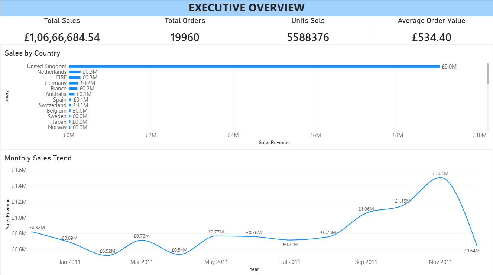
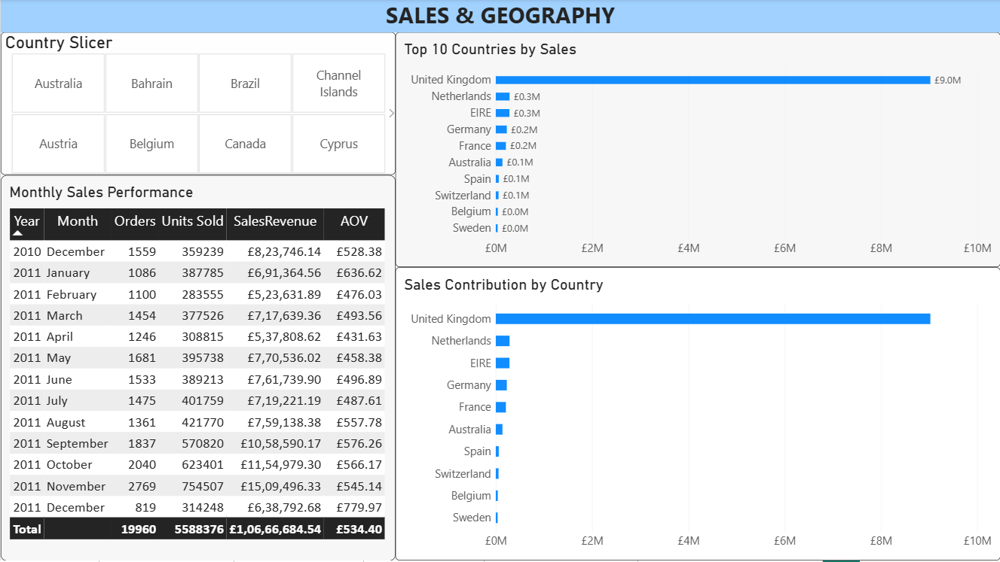
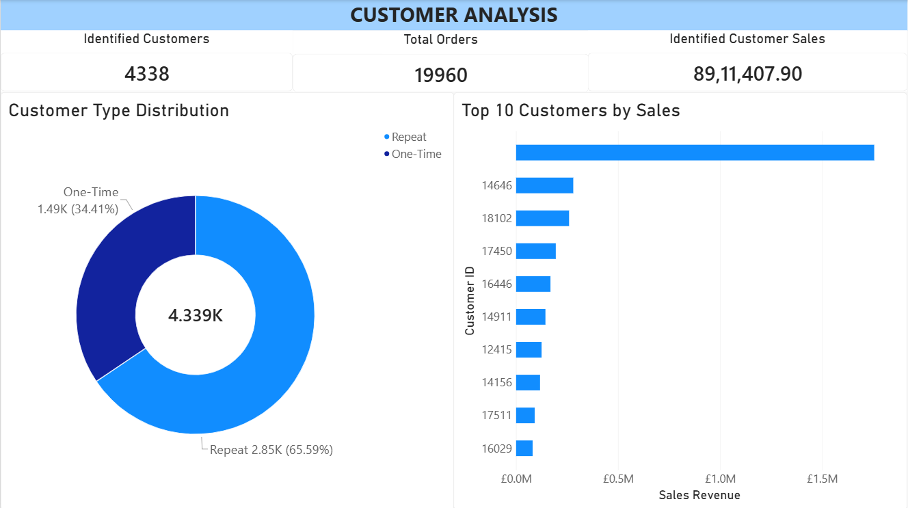
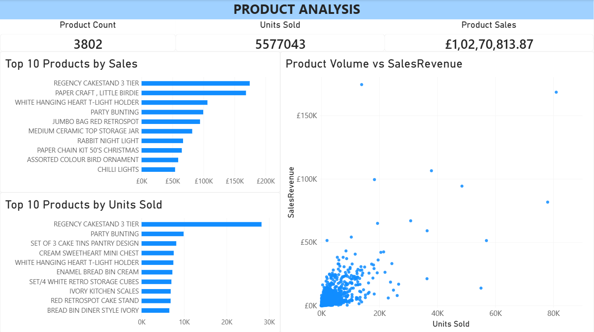
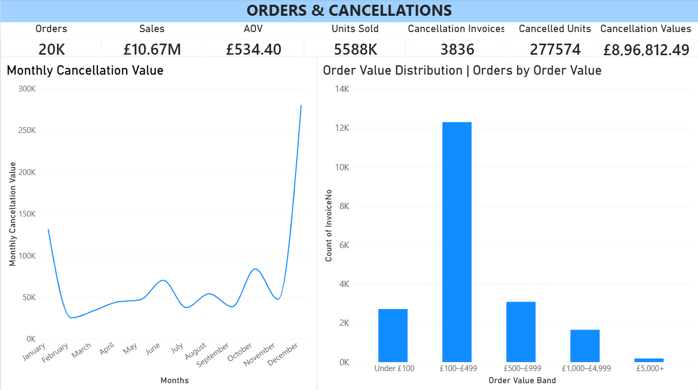
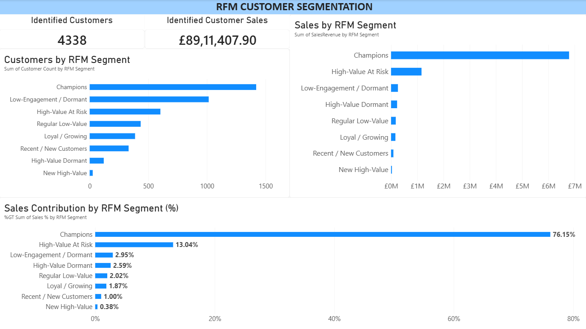

# Online Retail Analytics

## Project Overview

An end-to-end e-commerce analytics project using **SQL and Power BI** to analyze sales performance, customer behavior, product performance, order patterns, cancellations, and customer segmentation.

The project uses the **UCI Online Retail dataset**, containing transaction-level data from a UK-based online retailer between December 2010 and December 2011.

The analysis follows a practical business analytics workflow:

**Raw Transaction Data → Data Quality Checks → SQL Analysis → Business Findings → Power BI Dashboard → Business Recommendation**

---

## Business Questions

The project investigates questions such as:

* How are sales changing over time?
* Which countries generate the most sales?
* How concentrated is revenue among customers?
* What proportion of customers are one-time versus repeat buyers?
* Which products generate the most sales and units?
* What does the order-value distribution look like?
* How significant are cancellations?
* Which customer segments contribute the most sales?

---

## Tools Used

* **SQLite / SQL** — data cleaning, validation, analysis, aggregations, CTEs, subqueries, and window functions
* **Power BI** — data transformation, DAX measures, calculated columns, and interactive dashboards
* **Power Query** — data loading and transformation
* **GitHub** — project documentation and version control

---

## Dataset

**Source:** UCI Machine Learning Repository — Online Retail Dataset

The dataset contains transaction-level information including:

* Invoice number
* Stock code
* Product description
* Quantity
* Invoice date
* Unit price
* Customer ID
* Country

The dataset contains both positive sales transactions and cancellation/return records.

---

## SQL Analysis

The SQL analysis is organized into seven files:

| File                       | Analysis                                      |
| -------------------------- | --------------------------------------------- |
| `01_data_quality.sql`      | Data quality checks and validation            |
| `02_sales_analysis.sql`    | Sales, orders, revenue trends, and geography  |
| `03_customer_analysis.sql` | Customer behavior and revenue concentration   |
| `04_rfm_analysis.sql`      | Recency, frequency, and monetary segmentation |
| `05_product_analysis.sql`  | Product sales, volume, and concentration      |
| `06_order_analysis.sql`    | Order-level and order-value analysis          |
| `07_returns_analysis.sql`  | Cancellation and return analysis              |

---

## Power BI Dashboard

The Power BI report contains six analytical pages.

### 1. Executive Overview

High-level business KPIs, monthly sales trends, and sales by country.

### 2. Sales & Geography

Monthly sales performance, top countries by sales, country contribution, and geographic filtering.

### 3. Customer Analysis

Identified customers, customer sales, one-time versus repeat customers, and top customers by sales.

### 4. Product Analysis

Product sales, units sold, top products, and the relationship between product sales and volume.

Administrative and non-merchandise transactions such as postage, carriage, fees, samples, and manual adjustments are excluded from the merchandise-focused product visuals.

### 5. Orders & Cancellations

Order-value distribution, cancellation invoices, cancelled units, cancellation value, and monthly cancellation trends.

### 6. RFM Segmentation

Customer segmentation using Recency, Frequency, and Monetary value.

---

## Key Findings

### Overall Sales

* Total sales revenue: **£10,666,684.54**
* Total orders: **19,960**
* Total units sold: **5,588,376**
* Average order value: **£534.40**

### Sales Trend

* November 2011 recorded the highest full-month sales at **£1,509,496.33**.
* Sales increased strongly from September through November 2011.
* December 2011 is a **partial month**, with data available only through 9 December.

### Customers

* **4,338 identified customers** were analyzed.
* **1,493** customers were one-time customers.
* **2,845** customers were repeat customers.
* Repeat customers generated **£8,295,096.17**, representing **93.08% of identified-customer sales**.
* Sales from transactions without an identified CustomerID totaled **£1,755,276.64**.

### RFM Segmentation

The largest RFM segment was **Champions**, with:

* 1,420 customers
* £6,787,394.77 in sales
* 76.17% of identified-customer sales

Other segments included High-Value At Risk, High-Value Dormant, Loyal / Growing, Recent / New Customers, and lower-engagement customer groups.

### Geography

* The United Kingdom generated **£9,025,222.08** in sales.
* The UK represented **84.61% of total sales**.
* The Netherlands, EIRE, Germany, and France were the next largest countries by sales.

### Orders

* **62.62%** of orders contained 11 or more product lines.
* Orders between **£100 and £499** represented **61.66%** of all orders.
* The largest order was £168,469.60 and contained 80,995 units in one product line.

### Cancellations

* **3,836** cancellation invoices
* **277,574** cancelled units
* **£896,812.49** cancellation value
* Cancellation invoice rate: **19.22%**
* Cancelled unit rate: **4.97%**
* Cancellation value rate: **8.41%**

### Product Analysis

The product analysis separates merchandise from administrative/non-merchandise transactions.

An extreme bulk transaction involving **PAPER CRAFT, LITTLE BIRDIE** generated £168,469.60 from 80,995 units in a single order. This was retained as a documented business observation rather than automatically treated as an error.

---

## Business Recommendations

The analysis was translated into actionable business recommendations, including:

* **Customer retention:** Strengthen repeat purchasing and focus on valuable customers showing declining engagement.
* **Customer reactivation:** Target High-Value At Risk customers with focused re-engagement initiatives.
* **Cancellation reduction:** Investigate the products, customers, markets, and order patterns associated with cancellations.
* **Market diversification:** Explore opportunities to grow international markets while maintaining the UK customer base.
* **Customer data quality:** Improve customer identification to increase the value of customer-level analysis.
* **Seasonal planning:** Use historical demand patterns to support inventory, fulfillment, and operational planning.

See [`findings.md`](findings.md) for the supporting analysis, evidence, and detailed recommendations.

---

## Dashboard Preview

### Executive Overview



### Sales & Geography



### Customer Analysis



### Product Analysis



### Orders & Cancellations



### RFM Segmentation



---

## Project Structure

```text
Online-Retail-Analytics/
│
├── README.md
├── findings.md
│
├── data/
│   └── README.md
│
├── sql/
│   ├── 01_data_quality.sql
│   ├── 02_sales_analysis.sql
│   ├── 03_customer_analysis.sql
│   ├── 04_rfm_analysis.sql
│   ├── 05_product_analysis.sql
│   ├── 06_order_analysis.sql
│   └── 07_returns_analysis.sql
│
├── powerbi/
│   ├── Online_Retail_Analytics.pbix
│   └── README.md
│
└── screenshots/
    ├── overview.png
    ├── sales.png
    ├── customers.png
    ├── products.png
    ├── returns.png
    └── rfm.png
```

---

## Skills Demonstrated

### Data Analysis

* Data cleaning and validation
* Exploratory analysis
* KPI development
* Customer segmentation
* Revenue and order analysis
* Business insight generation

### SQL

* Filtering and aggregation
* GROUP BY and HAVING
* JOINs
* CTEs
* Subqueries
* Window functions
* Date analysis
* Customer and product segmentation

### Power BI

* Power Query
* Data modelling
* DAX measures
* Calculated columns
* KPI cards
* Time-series analysis
* Geographic analysis
* Customer segmentation
* Interactive filtering
* Dashboard design

---

## Data Notes

* The dataset ends on **9 December 2011**, so December 2011 represents a partial month.
* CustomerID contains missing values in the raw dataset.
* Cancellation records are analyzed separately from positive sales transactions.
* Several StockCodes represent administrative or non-merchandise transactions.
* Some extreme bulk transactions have a large effect on individual product and order metrics and are documented rather than automatically removed.
